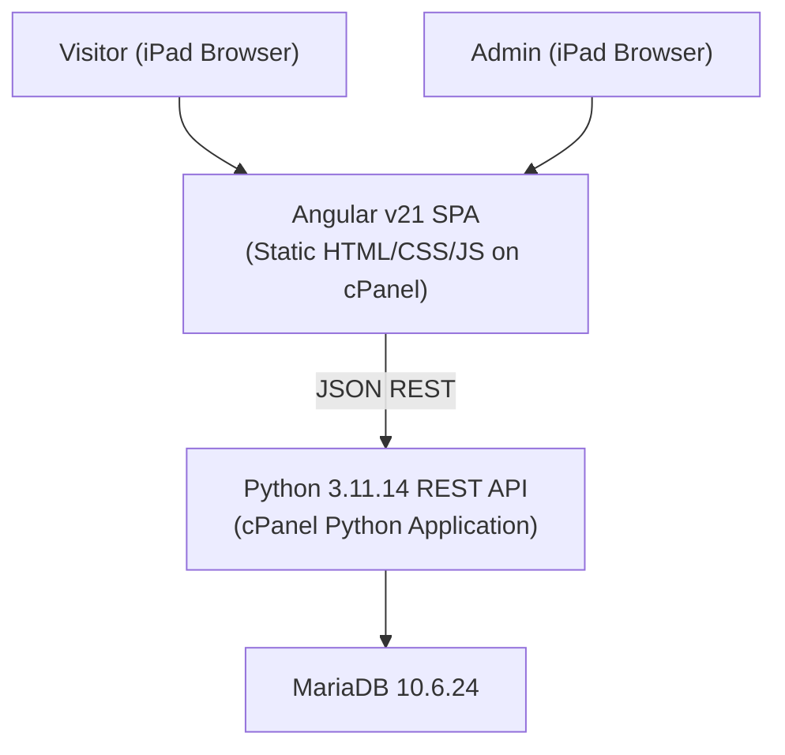

# Design Document: Drink Menu & Recipe Book

## Overview

A web application that serves as both a drink menu and recipe book. Visitors browse drinks that are currently makeable given the ingredients in the cabinet. Each drink links to either inline recipe instructions or an external URL. An admin interface (login-protected) manages ingredients and recipes.

**Tech Stack:**
- Frontend: Angular v21, compiled to static HTML/CSS/JS, served via cPanel
- Backend: Python 3.11.14, REST API running as a Python Application on cPanel
- Database: MariaDB 10.6.24
- Primary device: iPad (mobile-first)

The frontend communicates with the backend exclusively via a JSON REST API. The backend enforces all data integrity rules. The frontend handles display logic, client-side filtering/sorting, and form validation.

---

## Architecture



**Key architectural decisions:**

- Sorting and ingredient-based filtering of the drink list (not the ingredient list) are performed client-side on the already-filtered API response (API filters to cabinet-available drinks/ingredients only).
- The user can only filter on ingredients that are currently in the cabinet.
- Session tokens are stored in the browser's `localStorage` and sent as `Authorization: Bearer <token>` headers on admin requests.
- Alcohol percentage is stored as an integer (0–1000) in the database and divided by 10 for display in the Frontend (e.g., 150 → 15.0%).
- Images are stored as URL strings only; no file upload is supported.

---

## Components and Interfaces

### Frontend (Angular v21)

**Routes:**
- `/` — Drink menu (public)
- `/drink/:id` — Inline recipe detail (public)
- `/admin/login` — Admin login page
- `/admin/ingredients` — Ingredient management (auth-guarded)
- `/admin/recipes` — Recipe list management (auth-guarded)
- `/admin/recipes/new` — Add new recipe (auth-guarded)
- `/admin/recipes/:id/edit` — Edit recipe (auth-guarded)

**Components:**
- `DrinkMenuComponent` — Displays the filterable/sortable drink grid
- `DrinkCardComponent` — Single drink card (name, image, ABV)
- `RecipeDetailComponent` — Inline recipe detail view
- `LoginComponent` — Admin login form
- `IngredientManagerComponent` — Toggle cabinet status, add ingredients
- `RecipeManagerComponent` — List all drinks, edit/delete
- `RecipeFormComponent` — Shared form for add/edit (inline or link type)

**Services:**
- `DrinkService` — `GET /drinks`, `GET /drinks/:id`
- `IngredientService` — `GET /ingredients`
- `IngredientAdminService` - `GET /admin/ingredients`, `POST /admin/ingredients`, `PATCH /admin/ingredients/:id`
- `RecipeAdminService` — `GET /admin/drinks`, `POST /admin/drinks`, `PUT /admin/drinks/:id`, `DELETE /admin/drinks/:id`
- `AuthService` — `POST /auth/login`, `POST /auth/logout`, token storage
- `AuthGuard` — Redirects unauthenticated users to `/admin/login`

### Backend (Python REST API)

**Endpoints:**

| Method | Path | Auth | Description |
|--------|------|------|-------------|
| GET | `/drinks` | No | List drinks available from cabinet |
| GET | `/drinks/:id` | No | Get single drink with recipe |
| GET | `/ingredients` | No | List all ingredients currently in cabinet |
| POST | `/auth/login` | No | Authenticate admin |
| POST | `/auth/logout` | Yes | Invalidate session token |
| GET | `/admin/ingredients` | Yes | List all ingredients with cabinet status |
| POST | `/admin/ingredients` | Yes | Add new ingredient |
| PATCH | `/admin/ingredients/:id` | Yes | Toggle cabinet status |
| GET | `/admin/drinks` | Yes | List all drinks regardless of ingredient availability |
| POST | `/admin/drinks` | Yes | Create drink + recipe |
| PUT | `/admin/drinks/:id` | Yes | Update drink + recipe |
| DELETE | `/admin/drinks/:id` | Yes | Delete drink + recipe |

**Middleware:**
- Auth middleware validates `Authorization: Bearer <token>` on all `/admin/*` routes and returns 401 if missing or invalid.

---

## Data Models

### Database Schema

```sql
CREATE TABLE ingredients (
    id          INT AUTO_INCREMENT PRIMARY KEY,
    name        VARCHAR(255) NOT NULL UNIQUE,
    in_cabinet  BOOLEAN NOT NULL DEFAULT FALSE
);

CREATE TABLE drinks (
    id              INT AUTO_INCREMENT PRIMARY KEY,
    name            VARCHAR(255) NOT NULL,
    image_url       VARCHAR(2048),
    abv             INT NOT NULL,          -- stored as 0-1000 (divide by 10 for display)
    recipe_type     ENUM('inline','link') NOT NULL
);

CREATE TABLE drink_ingredients (
    drink_id        INT NOT NULL,
    ingredient_id   INT NOT NULL,
    PRIMARY KEY (drink_id, ingredient_id),
    FOREIGN KEY (drink_id) REFERENCES drinks(id) ON DELETE CASCADE,
    FOREIGN KEY (ingredient_id) REFERENCES ingredients(id) ON DELETE CASCADE
);

CREATE TABLE recipes (
    id              INT AUTO_INCREMENT PRIMARY KEY,
    drink_id        INT NOT NULL UNIQUE,
    instructions    TEXT,                  -- populated for inline type
    url             VARCHAR(2048),         -- populated for link type
    FOREIGN KEY (drink_id) REFERENCES drinks(id) ON DELETE CASCADE
);

CREATE TABLE admins (
    id              INT AUTO_INCREMENT PRIMARY KEY,
    username        VARCHAR(255) NOT NULL UNIQUE,
    password_hash   VARCHAR(255) NOT NULL  -- bcrypt hash
);

CREATE TABLE sessions (
    token       VARCHAR(255) PRIMARY KEY,
    admin_id    INT NOT NULL,
    created_at  DATETIME NOT NULL,
    expires_at  DATETIME NOT NULL,
    FOREIGN KEY (admin_id) REFERENCES admins(id) ON DELETE CASCADE
);
```

### API JSON Shapes

**Drink (list item):**
```json
{
  "id": 1,
  "name": "Margarita",
  "image_url": "https://example.com/margarita.jpg",
  "abv": 150,
  "recipe_type": "inline"
}
```

**Drink (detail):**
```json
{
  "id": 1,
  "name": "Margarita",
  "image_url": "https://example.com/margarita.jpg",
  "abv": 150,
  "recipe_type": "inline",
  "ingredients": ["Tequila", "Triple Sec", "Lime Juice"],
  "instructions": "Combine ingredients...\nShake well.",
  "url": null
}
```

**Ingredient:**
```json
{
  "id": 1,
  "name": "Tequila",
  "in_cabinet": true
}
```

**Session token response:**
```json
{
  "token": "abc123..."
}
```

---

## Correctness Properties

*A property is a characteristic or behavior that should hold true across all valid executions of a system — essentially, a formal statement about what the system should do. Properties serve as the bridge between human-readable specifications and machine-verifiable correctness guarantees.*

### Property 1: Cabinet filtering correctness

*For any* set of drinks in the database and any cabinet configuration, the `GET /drinks` endpoint should return only drinks for which every associated ingredient has `in_cabinet = true`.

**Validates: Requirements 1.2**

---

### Property 2: Drink card renders required fields

*For any* drink object returned by the API, the rendered drink card component should display the drink's name, an image element (either the stored URL or a placeholder), and the alcohol percentage.

**Validates: Requirements 1.3, 1.4**

---

### Property 3: Ingredient filter correctness

*For any* list of drinks and any non-empty selection of filter ingredients, the client-side filter function should return only drinks whose ingredient list contains every selected ingredient.

**Validates: Requirements 2.2**

---

### Property 4: Inline recipe detail renders all fields

*For any* drink with an inline recipe, the recipe detail page component should display the drink name, image, alcohol percentage, ingredient list, and text instructions.

**Validates: Requirements 3.1**

---

### Property 5: Newline rendering in instructions

*For any* instructions string containing one or more `\n` characters, the rendered output in the recipe detail component should present visual line breaks at each newline position.

**Validates: Requirements 3.2**

---

### Property 6: Recipe type round-trip

*For any* drink created with a given recipe type (`inline` or `link`), the `GET /drinks/:id` response should include a `recipe_type` field whose value matches the type used at creation.

**Validates: Requirements 3.4**

---

### Property 7: Auth guard covers all admin routes

*For any* admin route in the application, if no valid session token is present in storage, the Angular AuthGuard should redirect the user to `/admin/login` rather than rendering the admin component.

**Validates: Requirements 4.4**

---

### Property 8: API rejects unauthenticated admin requests

*For any* admin API endpoint (`/admin/*`), a request that omits a valid `Authorization: Bearer <token>` header should receive a 401 response regardless of the request body or method.

**Validates: Requirements 4.6**

---

### Property 9: Ingredient list renders with cabinet status

*For any* list of ingredients returned by the admin API, the ingredient management component should render every ingredient with its correct `in_cabinet` status displayed.

**Validates: Requirements 5.1**

---

### Property 10: Cabinet toggle round-trip

*For any* ingredient, calling `PATCH /admin/ingredients/:id` to toggle its `in_cabinet` status should result in the stored value being the logical opposite of its previous value.

**Validates: Requirements 5.2**

---

### Property 11: Add ingredient round-trip

*For any* valid unique ingredient name, after `POST /admin/ingredients` succeeds, the ingredient should appear in the list returned by `GET /admin/ingredients`.

**Validates: Requirements 5.3**

---

### Property 12: Inline drink creation round-trip

*For any* valid inline drink payload (name, ABV, at least one ingredient, instructions), after `POST /admin/drinks` succeeds, `GET /drinks/:id` should return a drink with matching name, ABV, recipe type `inline`, and instructions.

**Validates: Requirements 6.2**

---

### Property 13: Required field validation on recipe forms

*For any* recipe form submission (inline or link type) that omits at least one required field (name, ABV, ingredients, or type-specific content), the Angular form should be in an invalid state and no HTTP request should be dispatched to the API.

**Validates: Requirements 6.3, 7.3**

---

### Property 14: Link drink creation round-trip

*For any* valid link drink payload (name, ABV, at least one ingredient, URL), after `POST /admin/drinks` succeeds, `GET /drinks/:id` should return a drink with matching name, ABV, recipe type `link`, and URL, regardless of cabinet status of its ingredients.

**Validates: Requirements 7.2**

---

### Property 15: Admin recipe list shows all drinks

*For any* set of drinks in the database regardless of cabinet ingredient availability, the `GET /admin/drinks` endpoint (or equivalent) should return all drinks, and the recipe management component should render all of them.

**Validates: Requirements 8.1**

---

### Property 16: Edit form pre-population

*For any* existing drink, loading the edit form for that drink should result in every form field being pre-populated with the drink's current stored values.

**Validates: Requirements 8.2**

---

### Property 17: Edit drink round-trip

*For any* valid edit payload for an existing drink, after `PUT /admin/drinks/:id` succeeds, `GET /drinks/:id` should return the updated values.

**Validates: Requirements 8.3**

---

### Property 18: Delete drink removes record

*For any* existing drink, after `DELETE /admin/drinks/:id` succeeds, `GET /drinks/:id` should return a 404 response, and the drink should not appear in any drink listing.

**Validates: Requirements 8.4**

---

### Property 19: Image URL round-trip

*For any* image URL string provided when creating or editing a drink, the API should return that exact URL string in the drink's `image_url` field.

**Validates: Requirements 9.2**

---

### Property 20: API required field enforcement

*For any* request to create or update a drink that omits drink name, alcohol percentage, recipe type, or all ingredients, the API should return a 400 response with a non-empty error message.

**Validates: Requirements 10.1, 10.2**

---

### Property 21: ABV storage and display transformation

*For any* integer ABV value N in the range [0, 1000], a drink created with that value should be returned by the API with `abv` equal to N (raw), and any value outside [0, 1000] should result in a 400 response.

**Validates: Requirements 10.3, 10.4**

---

## Error Handling

### API Error Responses

| Scenario | HTTP Status | Response Body |
|----------|-------------|---------------|
| Missing required field on create/update | 400 | `{"error": "<field> is required"}` |
| ABV out of range | 400 | `{"error": "abv must be between 0 and 1000"}` |
| Duplicate ingredient name | 409 | `{"error": "Ingredient already exists"}` |
| Invalid/missing auth token | 401 | `{"error": "Unauthorized"}` |
| Resource not found | 404 | `{"error": "Not found"}` |
| Malformed request body | 400 | `{"error": "Invalid request"}` |

### Frontend Error Handling

- Form validation errors are shown inline next to the relevant field before submission.
- API errors (4xx/5xx) are caught in Angular services and surfaced via a shared error notification component.
- If the drink list API call fails on page load, the frontend displays a generic "Unable to load drinks" message.
- If a drink detail API call fails (e.g., 404), the frontend navigates back to the menu with an error toast.
- Auth errors (401) from any admin API call trigger automatic logout and redirect to `/admin/login`.

### Session Expiry

- Sessions have a server-side expiry. The API returns 401 for expired tokens.
- The frontend treats any 401 on an admin request as a session expiry and redirects to login.

---

## Testing Strategy

### Dual Testing Approach

Both unit tests and property-based tests are required. They are complementary:
- Unit tests cover specific examples, integration points, and error conditions.
- Property-based tests verify universal correctness across randomized inputs.

### Frontend Testing (Angular)

**Unit tests** (Jest):
- `DrinkMenuComponent`: loads drinks on init, renders empty state message when list is empty.
- `LoginComponent`: shows error message on 401 response, stores token on success.
- `AuthGuard`: redirects to `/admin/login` when no token present.
- `RecipeDetailComponent`: navigates to external URL for link-type drinks.
- `RecipeFormComponent`: does not call API when form is invalid.

**Property-based tests** (fast-check):
- Minimum 100 iterations per property test.
- Each test is tagged with a comment: `// Feature: drink-menu-recipe-book, Property <N>: <property_text>`

| Property | Test Description |
|----------|-----------------|
| Property 2 | For any generated drink object, DrinkCardComponent renders name, image element, and ABV |
| Property 3 | For any drink list and ingredient filter selection, client-side filter returns only drinks containing all selected ingredients |
| Property 4 | For any inline drink, RecipeDetailComponent renders all required fields |
| Property 5 | For any instructions string with `\n`, rendered output contains visual line breaks |
| Property 7 | For any admin route, AuthGuard redirects to login when token is absent |
| Property 9 | For any ingredient list, IngredientManagerComponent renders all items with correct cabinet status |
| Property 13 | For any recipe form with a missing required field, form is invalid and no HTTP call is made |
| Property 16 | For any drink, edit form fields are pre-populated with current drink values |

### Backend Testing (Python — pytest + hypothesis)

**Unit tests** (pytest):
- Login endpoint returns token on valid credentials, 401 on invalid.
- Logout endpoint invalidates token.
- Duplicate ingredient name returns 409.
- Missing auth header returns 401 on all `/admin/*` routes.
- Edit/delete non-existent drink returns 404.

**Property-based tests** (Hypothesis):
- Minimum 100 iterations per property test (configured via `@settings(max_examples=100)`).
- Each test is tagged: `# Feature: drink-menu-recipe-book, Property <N>: <property_text>`

| Property | Test Description |
|----------|-----------------|
| Property 1 | For any drinks/cabinet state, GET /drinks returns only fully-available drinks |
| Property 6 | For any drink, recipe_type round-trips through create → retrieve |
| Property 8 | For any admin endpoint, request without valid token returns 401 |
| Property 10 | For any ingredient, PATCH toggle results in opposite in_cabinet value |
| Property 11 | For any unique ingredient name, POST then GET includes the new ingredient |
| Property 12 | For any valid inline drink, POST then GET returns matching fields |
| Property 14 | For any valid link drink, POST then GET returns matching fields |
| Property 15 | For any drinks in DB, admin drink list returns all regardless of cabinet state |
| Property 17 | For any valid edit payload, PUT then GET returns updated values |
| Property 18 | For any drink, DELETE then GET returns 404 |
| Property 19 | For any image URL string, stored URL round-trips through create → retrieve |
| Property 20 | For any request missing a required field, API returns 400 with error message |
| Property 21 | For any ABV in [0,1000], stored as N, returned as N; outside range returns 400 |
